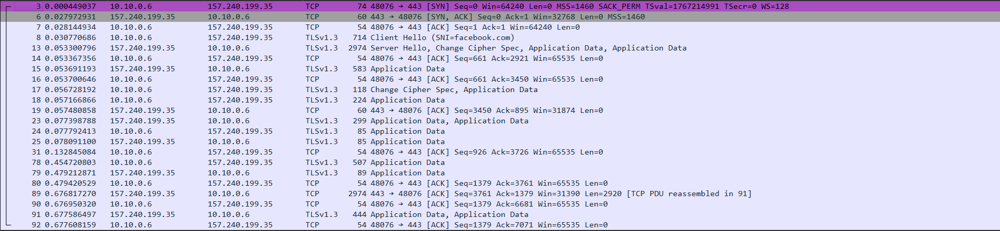
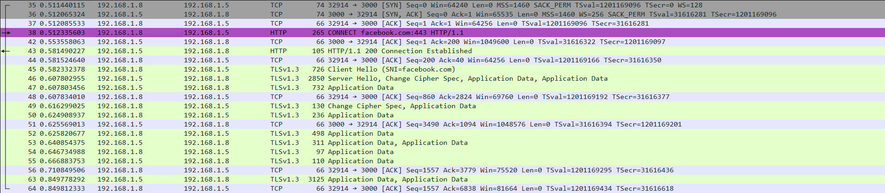
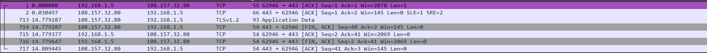
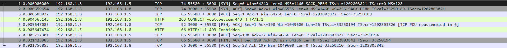

# Các hệ thống ngăn chặn tấn công mạng. Firewall, các kiến trúc firewall, Proxy, thiết kế và xây dựng Proxy

## I. Giới thiệu về các hệ thống ngăn chặn tấn công mạng
### 1. Mục tiêu

Hiểu rõ khái niệm và tầm quan trọng của các hệ thống ngăn chặn tấn công mạng.

### 2. Nội dung

#### 2.1. Định Nghĩa Tấn Công Mạng

Tấn công mạng là bất kỳ hành vi xâm phạm nào nhằm vào hệ thống máy tính, mạng hoặc các thiết bị điện tử khác, với mục tiêu làm gián đoạn, phá hoại hoặc đánh cắp dữ liệu. Các loại tấn công mạng thường gặp bao gồm:

* **Tấn công từ chối dịch vụ (DDoS)**: Làm quá tải hệ thống mạng hoặc Server bằng cách gửi nhiều yêu cầu, khiến hệ thống ngừng hoạt động.
* **Phần mềm độc hại (Malware)**: Bao gồm virus, trojan, spyware, ransomware, được cài đặt lén lút để xâm nhập, theo dõi hoặc phá hoại hệ thống.
* **Tấn công giả mạo (Phishing)**: Sử dụng các trang web hoặc email giả mạo để đánh lừa người dùng cung cấp thông tin cá nhân.
* **Tấn công dựa trên lỗ hổng (Exploit Attack)**: Sử dụng các lỗ hổng trong phần mềm hoặc hệ thống để xâm nhập và kiểm soát hệ thống.
* **Ransomware**: Mã hóa dữ liệu của nạn nhân và yêu cầu tiền chuộc để mở khóa.

#### 2.2. Tại Sao Cần Bảo Mật Mạng?

Bảo mật mạng đóng vai trò quan trọng không chỉ trong bảo vệ thông tin mà còn trong duy trì tính ổn định và liên tục của các dịch vụ. Một số lý do nổi bật để bảo mật mạng bao gồm:

* **Bảo vệ dữ liệu cá nhân và thông tin nhạy cảm**: Các cuộc tấn công có thể khiến thông tin cá nhân, tài chính và các dữ liệu quan trọng khác bị đánh cắp hoặc xâm phạm.
* **Đảm bảo tính liên tục của dịch vụ**: Khi hệ thống mạng bị tấn công hoặc bị gián đoạn, các dịch vụ quan trọng (như dịch vụ tài chính, y tế) có thể bị ảnh hưởng nghiêm trọng.
* **Giảm thiểu rủi ro tài chính**: Các cuộc tấn công mạng có thể gây thiệt hại lớn về tài chính cho các doanh nghiệp, từ việc phải chi trả cho khôi phục hệ thống đến mất doanh thu do ngừng dịch vụ.
* **Tuân thủ quy định pháp lý**: Nhiều quốc gia và tổ chức quốc tế đã ban hành các quy định về bảo vệ dữ liệu và an ninh mạng, yêu cầu các tổ chức thực hiện các biện pháp bảo mật cần thiết.

#### 2.3. Tổng Quan về Các Phương Pháp Bảo Vệ

Bảo vệ hệ thống mạng cần áp dụng nhiều lớp bảo vệ và kỹ thuật để ngăn chặn các mối đe dọa từ nhiều nguồn khác nhau. Các phương pháp bảo vệ chủ yếu bao gồm:

##### 2.3.1. Firewall (Tường lửa)

Tường lửa là lớp bảo vệ cơ bản, giúp kiểm soát lưu lượng vào và ra khỏi hệ thống mạng. Tường lửa hoạt động dựa trên các quy tắc cấu hình sẵn, giúp ngăn chặn các truy cập trái phép từ bên ngoài:

* **Tường lửa phần cứng**: Thường được triển khai ở các doanh nghiệp, giúp bảo vệ toàn bộ mạng bằng cách kiểm soát lưu lượng ở cổng vào của hệ thống.
* **Tường lửa phần mềm**: Được cài đặt trực tiếp trên các thiết bị cá nhân để bảo vệ thiết bị khỏi các mối đe dọa.
* **Tường lửa ứng dụng (Application Firewall)**: Tường lửa ở mức ứng dụng có thể kiểm soát lưu lượng ở các ứng dụng, bảo vệ chống lại các cuộc tấn công ứng dụng web.

##### 2.3.2. IDS/IPS (Hệ thống phát hiện và ngăn chặn xâm nhập)

* **IDS (Intrusion Detection System)**: Là hệ thống phát hiện xâm nhập, giúp giám sát và phát hiện các dấu hiệu bất thường hoặc có nguy cơ. IDS không ngăn chặn mà sẽ cảnh báo người quản trị hệ thống khi phát hiện dấu hiệu xâm nhập.
* **IPS (Intrusion Prevention System)**: Hệ thống ngăn chặn xâm nhập hoạt động giống IDS nhưng chủ động hơn, tự động thực hiện các biện pháp ngăn chặn như chặn lưu lượng hoặc cô lập nguồn tấn công khi phát hiện.

##### 2.3.3. Proxy (Server trung gian)

Proxy là Server trung gian đóng vai trò là cầu nối giữa người dùng và Internet, giúp bảo vệ quyền riêng tư và giảm thiểu rủi ro tấn công:

* **Proxy ẩn danh (Anonymous Proxy)**: Giúp người dùng ẩn địa chỉ IP của mình, tăng cường bảo vệ quyền riêng tư.
* **Proxy trong suốt (Transparent Proxy)**: Được sử dụng để quản lý quyền truy cập, không che giấu địa chỉ IP của người dùng nhưng giúp giám sát và kiểm soát lưu lượng.
* **Reverse Proxy**: Hoạt động như một đại diện cho Server, giúp bảo vệ Server khỏi các cuộc tấn công trực tiếp và tăng khả năng cân bằng tải.

##### 2.3.4. VPN (Mạng riêng ảo)

VPN là công nghệ mã hóa dữ liệu, giúp bảo vệ an toàn dữ liệu trong quá trình truyền tải và cho phép người dùng kết nối từ xa vào mạng nội bộ một cách bảo mật.

##### 2.3.5. WAF (Tường lửa ứng dụng web)

Web Application Firewall bảo vệ các ứng dụng web khỏi các cuộc tấn công dựa trên ứng dụng như:

* **SQL Injection**: Tấn công bằng cách chèn mã SQL vào truy vấn cơ sở dữ liệu để lấy cắp thông tin.
* **Cross-Site Scripting (XSS)**: Tấn công thông qua chèn mã độc vào các trang web, nhằm đánh cắp thông tin người dùng.

##### 2.3.6. Hệ thống mã hóa dữ liệu

Mã hóa dữ liệu chuyển đổi dữ liệu thành dạng mà chỉ những người có khóa mã hóa mới có thể đọc được. Mã hóa là lớp bảo mật quan trọng trong việc ngăn chặn rò rỉ thông tin và bảo vệ dữ liệu khi bị đánh cắp.

##### 2.3.7. Kiểm soát truy cập và xác thực người dùng

Đảm bảo rằng chỉ những người có quyền truy cập mới có thể vào hệ thống. Một số phương pháp phổ biến bao gồm:

* **Xác thực hai yếu tố (Two-Factor Authentication - 2FA)**: Yêu cầu người dùng cung cấp hai lớp xác minh (mật khẩu và mã OTP) để đăng nhập.
* **Hệ thống kiểm soát truy cập (Access Control)**: Phân quyền cho người dùng dựa trên vai trò và cấp độ truy cập của họ.

### 3. Kết luận

Các hệ thống ngăn chặn tấn công mạng là phần không thể thiếu trong việc bảo vệ an toàn dữ liệu và hệ thống mạng. Việc kết hợp nhiều giải pháp bảo mật và thường xuyên cập nhật, nâng cấp các công cụ sẽ giúp tăng cường khả năng phòng thủ trước các mối đe dọa mạng ngày càng phức tạp và tinh vi.

## II. Tìm hiểu về Firewall
### 1. Định nghĩa

Firewall là một công cụ bảo mật giúp bảo vệ mạng máy tính bằng cách kiểm soát các kết nối ra vào. Nó hoạt động như một “lá chắn” giữa mạng nội bộ an toàn và các kết nối bên ngoài, chỉ cho phép những kết nối an toàn được phép vào. Firewall ngăn chặn hacker, virus, và các mối nguy hại khác xâm nhập vào hệ thống của bạn, giữ cho dữ liệu và thiết bị luôn được an toàn.
### 2. Các loại firewall
#### 2.1. Packet Filtering Firewall

**Packet Filtering Firewall** là một thiết bị bảo mật mạng, có chức năng kiểm tra và lọc các gói dữ liệu ra vào mạng dựa trên một tập hợp các quy tắc được thiết lập trước. Những quy tắc này thường dựa trên các yếu tố như địa chỉ IP, số cổng, và giao thức. Tường lửa sẽ kiểm tra phần tiêu đề của mỗi gói dữ liệu để quyết định xem có nên cho phép hay chặn gói đó. Tuy nhiên, Packet Filtering Firewall chỉ kiểm tra phần tiêu đề, không kiểm tra nội dung bên trong gói dữ liệu để phát hiện các mối đe dọa.

---

#### Các loại Packet Filtering Firewall

1. **Dynamic Packet Filtering Firewall**: Tường lửa linh hoạt có khả năng tự điều chỉnh quy tắc dựa trên điều kiện lưu lượng mạng, thích hợp cho các giao thức sử dụng cổng động như FTP, tăng cường bảo mật mà không ảnh hưởng đến chức năng ứng dụng.

2. **Static Packet Filtering Firewall**: Tường lửa cấu hình cố định, chỉ thay đổi quy tắc khi có can thiệp từ quản trị viên. Phù hợp cho mạng nhỏ và đơn giản, cung cấp mức bảo mật cơ bản.

3. **Stateless Packet Filtering Firewall**: Tường lửa xử lý từng gói dữ liệu độc lập, không lưu lại ngữ cảnh, cho phép tốc độ xử lý nhanh nhưng kém an toàn hơn, dễ bỏ sót các cuộc tấn công phức tạp.

4. **Stateful Packet Filtering Firewall**: Tường lửa ghi nhớ trạng thái kết nối, giúp xác định và bảo vệ tốt hơn trước các truy cập trái phép, cung cấp mức độ bảo mật cao nhờ khả năng phân tích ngữ cảnh.

##### Cách hoạt động của Packet Filtering Firewall

- Packet Filtering Firewall hoạt động ở mức cơ bản, bằng cách áp dụng các quy tắc cho từng gói dữ liệu cố gắng vào hoặc ra khỏi mạng.
- Các quy tắc do quản trị viên mạng định nghĩa, đảm bảo tính bảo mật và toàn vẹn của mạng.

Các thành phần chính mà Packet Filtering Firewall dựa vào để xác định tính hợp lệ của gói dữ liệu bao gồm:

- **Phần tiêu đề**: Chứa địa chỉ IP nguồn và đích, cũng như số cổng và giao thức (TCP/UDP).
- **Cờ trong tiêu đề TCP**: Chẳng hạn như tín hiệu yêu cầu kết nối.
- **Hướng lưu lượng**: Gói dữ liệu đi vào hoặc ra khỏi mạng.
- **Giao diện mạng**: Nơi mà gói dữ liệu đi qua.

Tường lửa quyết định có cho phép hay chặn gói dữ liệu dựa trên các yếu tố này.

---

##### Các trường hợp sử dụng Packet Filtering Firewall

1. **Ngăn chặn tấn công IP spoofing**:
   - Packet Filtering Firewall thường được sử dụng để ngăn chặn các cuộc tấn công giả mạo địa chỉ IP (IP spoofing). Bằng cách kiểm tra địa chỉ IP nguồn của các gói đến, tường lửa có thể ngăn chặn những kẻ tấn công giả mạo là thành phần hợp pháp trong mạng.

2. **Quản lý và tối ưu hóa lưu lượng mạng**:
   - Packet Filtering Firewall có thể giới hạn lưu lượng giữa các mạng con trong doanh nghiệp, giúp phân tách tài nguyên và ngăn chặn sự lây lan của các mối đe dọa.

3. **Tốc độ và hiệu quả tài nguyên**:
   - Packet Filtering Firewall phù hợp trong những tình huống yêu cầu tốc độ và hiệu quả tài nguyên, vì nó xử lý lưu lượng nhanh chóng mà không tốn quá nhiều tài nguyên hệ thống.
#### Lợi ích và Hạn chế của Packet Filtering Firewall

#### Lợi ích

1. **Hiệu suất cao**:
   - Packet filtering firewall có khả năng xử lý nhanh chóng, ra quyết định nhanh bằng cách hoạt động ở lớp mạng (Layer 3). Nó chấp nhận hoặc từ chối các gói dữ liệu dựa trên các quy tắc được thiết lập sẵn mà không cần kiểm tra sâu, giúp xử lý lưu lượng mạng nhanh chóng và giảm thiểu nguy cơ tắc nghẽn.

2. **Hoạt động trong suốt**:
   - Packet filtering firewall hoạt động một cách minh bạch đối với người dùng. Nó tự động áp dụng các quy tắc vào lưu lượng mạng mà không yêu cầu sự can thiệp hoặc thông báo cho người dùng, trừ khi một gói dữ liệu bị chặn. Điều này giúp đảm bảo các biện pháp bảo mật mạng không gây cản trở trải nghiệm người dùng và không đòi hỏi nhiều đào tạo.

3. **Tiết kiệm chi phí**:
   - Packet filtering firewall có tính kinh tế cao. Thường được tích hợp vào các bộ định tuyến mạng, nó loại bỏ nhu cầu sử dụng các thiết bị tường lửa riêng biệt, giúp giảm chi phí triển khai.

4. **Đơn giản và dễ sử dụng**:
   - Packet filtering firewall ban đầu được thiết kế để dễ sử dụng với cấu hình đơn giản, không yêu cầu cài đặt phức tạp, phù hợp cho những hệ thống mạng cơ bản.

---

#### Hạn chế

1. **Khả năng ghi nhật ký hạn chế**:
   - Một nhược điểm lớn của packet filtering firewall là khả năng ghi nhật ký hạn chế. Hệ thống thường chỉ ghi lại các thông tin cơ bản về lưu lượng mạng, gây khó khăn cho việc tuân thủ các tiêu chuẩn bảo vệ dữ liệu chặt chẽ và khó phát hiện các hoạt động đáng ngờ.

2. **Thiếu tính linh hoạt**:
   - Packet filtering firewall không linh hoạt trong việc quản lý truy cập mạng hiện đại. Nó chỉ giám sát các chi tiết cơ bản như địa chỉ IP và cổng, không thể điều chỉnh theo các mối đe dọa phức tạp hiện nay. Việc thiết lập và bảo trì các quy tắc phải thực hiện thủ công, tốn thời gian và không đáp ứng được những nhu cầu bảo mật nâng cao.

3. **Kém bảo mật hơn**:
   - So với các loại tường lửa tiên tiến, packet filtering firewall kém an toàn vì nó chỉ dựa trên thông tin cơ bản mà không xem xét ngữ cảnh của thiết bị hoặc ứng dụng. Nó không thể kiểm tra nội dung bên trong gói dữ liệu, khiến hệ thống dễ bị tấn công thông qua việc giả mạo địa chỉ IP và các cuộc tấn công phức tạp khác.

4. **Hoạt động phi trạng thái (Stateless)**:
   - Packet filtering firewall không ghi nhớ các gói dữ liệu đã qua, dẫn đến hạn chế trong việc bảo vệ chống lại các mối đe dọa phức tạp. Mỗi gói dữ liệu được xử lý độc lập, và nếu các quy tắc tường lửa không được thiết lập cẩn thận, các mối đe dọa có thể dễ dàng lọt qua.

5. **Khó quản lý**:
   - Mặc dù ban đầu dễ sử dụng, packet filtering firewall trở nên khó quản lý khi mạng ngày càng phức tạp. Các quy tắc phải được cấu hình và cập nhật thủ công, tăng tải công việc cho đội ngũ bảo mật và dễ xảy ra lỗi do con người.

6. **Không tương thích với một số giao thức**:
   - Packet filtering firewall gặp khó khăn với các giao thức yêu cầu phân bổ cổng động hoặc lưu trữ trạng thái, hạn chế khả năng sử dụng các dịch vụ hợp pháp và làm phức tạp việc thực thi các chính sách bảo mật.

### 2.2. Stateful Inspection Firewall

**Stateful Inspection Firewall** là một loại thiết bị bảo mật mạng có khả năng giám sát và phân tích lưu lượng truy cập vào và ra khỏi mạng. Khác với các tường lửa truyền thống chỉ lọc gói dữ liệu dựa trên địa chỉ IP nguồn và đích, stateful inspection firewall còn xem xét ngữ cảnh của các gói dữ liệu để đưa ra quyết định chính xác hơn.

---

##### Cách hoạt động của Stateful Inspection Firewall

- **Bảng trạng thái (State Table)**: Stateful inspection firewall duy trì một bảng trạng thái chứa thông tin về các kết nối và trạng thái của mỗi phiên mạng. Điều này cho phép tường lửa xác định xem một gói dữ liệu có thuộc về một kết nối đã được thiết lập hay đang cố gắng khởi tạo kết nối mới.
  
- **Phân tích ngữ cảnh**: Bằng cách hiểu trạng thái của các phiên mạng, tường lửa có thể áp dụng các chính sách bảo mật nâng cao để đảm bảo chỉ lưu lượng hợp lệ và được cấp phép mới được phép đi qua.

- **Kiểm tra sâu gói dữ liệu (Deep Packet Inspection)**: Stateful inspection firewall có thể thực hiện kiểm tra sâu gói dữ liệu để phát hiện và chặn nội dung độc hại, giúp tăng cường bảo mật trước các mối đe dọa phức tạp.

---

##### Ưu điểm của Stateful Inspection Firewall

1. **Bảo vệ toàn diện**: Bằng cách phân tích cả phiên mạng thay vì chỉ các gói riêng lẻ, stateful inspection firewall cung cấp mức độ bảo vệ tốt hơn trước các cuộc tấn công phức tạp.
   
2. **Phát hiện và ngăn chặn tấn công**: Tường lửa này có thể phát hiện và ngăn chặn các kiểu tấn công như giả mạo IP (IP spoofing), quét cổng (port scanning), và chiếm quyền điều khiển phiên (session hijacking) nhờ vào khả năng theo dõi trạng thái của các kết nối.
   
3. **Hỗ trợ Network Address Translation (NAT)**: Stateful inspection firewall có thể hỗ trợ NAT để ẩn địa chỉ IP nội bộ và bảo vệ khỏi các cuộc tấn công giả mạo địa chỉ IP.

4. **Khả năng lọc lưu lượng hiệu quả**: Tường lửa lưu trữ trạng thái của các kết nối, giúp xử lý gói dữ liệu nhanh chóng mà không cần kiểm tra sâu từng gói riêng lẻ, tăng hiệu quả vận hành.

---

##### Hạn chế của Stateful Inspection Firewall

- **Hạn chế trong xử lý các tấn công ở lớp ứng dụng**: Mặc dù mạnh mẽ ở mức mạng, stateful inspection firewall không hiệu quả trong việc phát hiện các cuộc tấn công lớp ứng dụng như SQL injection hoặc cross-site scripting (XSS), cần đến các giải pháp bảo mật nâng cao khác.

- **Khó khăn trong xử lý lưu lượng mã hóa**: Stateful inspection firewall có khả năng hạn chế trong việc xử lý lưu lượng được mã hóa, khiến việc kiểm tra sâu các gói dữ liệu gặp khó khăn.

- **Đòi hỏi tài nguyên**: Tường lửa này cần nhiều bộ nhớ và sức xử lý để duy trì thông tin trạng thái cho các kết nối, có thể làm ảnh hưởng đến hiệu suất trong môi trường có lưu lượng cao.

---

**Vai trò của Stateful Inspection Firewall trong mạng hiện đại**

Tường lửa này thường được triển khai ở ranh giới mạng (như khu vực ngoại vi) để giám sát và kiểm soát lưu lượng ra vào mạng. Stateful inspection firewall kết hợp với các công nghệ bảo mật khác, như hệ thống phát hiện xâm nhập (IDS) và mạng riêng ảo (VPN), giúp xây dựng một cơ sở hạ tầng bảo mật toàn diện, bảo vệ tổ chức trước nhiều loại tấn công khác nhau.

### 2.3 Proxy Firewall

##### Định nghĩa Proxy Firewall

Proxy firewalls là các thiết bị bảo mật mạng nằm giữa các Server nội bộ và Internet bên ngoài. Còn được gọi là tường lửa ứng dụng (application firewalls) hoặc tường lửa cổng (gateway firewalls), chúng hoạt động ở lớp ứng dụng của mô hình OSI (lớp 7). Proxy firewall giám sát các gói dữ liệu ra vào, áp dụng bộ lọc bảo mật và chặn các mối đe dọa độc hại.

- **Proxies (Proxy Server)**: Proxy hoạt động như một trung gian giữa các mạng bên ngoài và bên trong, ẩn danh địa chỉ IP của người dùng và kiểm soát nội dung web truy cập được trên mạng nội bộ.
- **Firewalls (Tường lửa)**: Tường lửa lọc lưu lượng mạng và phân tích dữ liệu trong gói để xác định tính hợp lệ, chỉ cho phép các yêu cầu truy cập mạng vượt qua các bài kiểm tra bảo mật định trước.

---

##### Cách hoạt động của Proxy Firewall

Proxy firewalls hoạt động ở Lớp 7 của mô hình OSI (lớp ứng dụng) và có địa chỉ IP riêng. Proxy firewall tạo ra một bản sao (mirror) của ứng dụng để kiểm tra lưu lượng, tách biệt mạng nội bộ và bên ngoài. Lưu lượng vào và ra đều phải đi qua Proxy trước khi kết nối mạng được xác nhận, giúp bảo vệ chống lại sự xâm nhập trái phép.

Một ví dụ là khi người dùng yêu cầu kết nối TCP/IP, Proxy firewall sử dụng tín hiệu SYN-ACK để kết nối với cả Server bên ngoài và thiết bị nội bộ, đảm bảo mọi lưu lượng đều phải thông qua Proxy trước khi kết nối được xác nhận. Proxy firewall cũng có thể chặn các giao thức như SMTP và lọc các lưu lượng HTTP để kiểm soát nội dung truy cập.

---

##### Các loại Proxy Firewall

1. **Forward Proxy (Proxy Chuyển Tiếp)**: Nằm giữa Server nội bộ và Internet, quản lý lưu lượng trước khi vào mạng nội bộ. Proxy có thể lưu trữ dữ liệu để giảm tải mạng.
  
2. **Reverse Proxy (Proxy Đảo Chiều)**: Đặt giữa Server nội dung và Internet, kiểm soát lưu lượng rời khỏi Server nội dung và điều hướng tới mạng nội bộ. Reverse Proxy hỗ trợ phân phối tải và tăng tốc độ truy cập nội dung.

3. **Transparent Proxy (Proxy Minh Bạch)**: Gần như vô hình với người dùng, hoạt động như Proxy chuyển tiếp hoặc đảo chiều. Loại Proxy này không thay đổi định dạng yêu cầu hoặc phản hồi, giúp kiểm soát nội dung mà không bị phát hiện.

---

##### Vai trò của Proxy Firewall trong bảo mật mạng

Proxy firewalls thường được triển khai trên các Server trọng yếu (bastion hosts) trong mạng, là những điểm dễ bị tấn công nhất và cần bảo vệ đặc biệt. Proxy firewall giúp cung cấp một lớp bảo vệ chuyên sâu cho các ứng dụng, kiểm soát lưu lượng ở mức ứng dụng, chặn các yêu cầu không hợp lệ và bảo vệ các tài nguyên quan trọng của mạng.

Ngoài ra, Proxy firewall có thể lọc các yêu cầu DNS, chặn các trang web độc hại và cho phép chỉ những trang web an toàn, giúp giảm nguy cơ tấn công mạng.

---

##### Ưu điểm của Proxy Firewall

1. **An ninh cao hơn**: Không có kết nối trực tiếp giữa tài sản nội bộ và mạng ngoài, giúp giảm nguy cơ xâm nhập. Proxy firewall thực hiện kiểm tra gói dữ liệu sâu (Deep Packet Inspection) để phát hiện các mối đe dọa.

2. **Khả năng ghi nhật ký và kiểm toán**: Proxy firewall có thể ghi lại thông tin gói dữ liệu trong bộ nhớ đệm, cho phép kiểm toán và phân tích bảo mật.

3. **Phân tích mối đe dọa an toàn**: Proxy tạo ra một vùng an toàn giữa mạng nội bộ và Internet, cho phép kiểm tra và cô lập mối đe dọa mà không ảnh hưởng tới tài nguyên mạng.

4. **Kiểm soát lưu lượng**: Proxy firewall giúp thiết lập quyền truy cập chi tiết, kiểm soát nội dung trang web và lưu lượng mạng, đồng thời giảm tải bằng cách lưu trữ các trang web phổ biến.

---

##### Nhược điểm của Proxy Firewall

1. **Ảnh hưởng đến hiệu suất**: Proxy firewall có thể làm chậm tốc độ mạng do phải kiểm tra lưu lượng ở lớp ứng dụng.
  
2. **Phức tạp trong quản lý**: Proxy firewall yêu cầu cấu hình và bảo trì liên tục, tăng khối lượng công việc cho đội ngũ IT và yêu cầu kiến thức chuyên môn.

3. **Khó khăn trong mở rộng quy mô**: Proxy firewall khó xử lý lưu lượng cao, có thể dẫn đến nghẽn hiệu suất và khó duy trì các chính sách bảo mật trong môi trường mạng lớn.

4. **Điểm lỗi đơn (Single Point of Failure)**: Proxy firewall có thể trở thành điểm lỗi đơn, gây gián đoạn nếu bị lỗi, nên cần thiết lập cơ chế dự phòng mạnh mẽ.

---

### 2.4. Next-Generation Firewall (NGFW)

#### Định nghĩa
Next-Generation Firewall là tường lửa thế hệ mới với khả năng xử lý lưu lượng mạng ở nhiều lớp khác nhau của mô hình OSI, từ lớp 3 (Network Layer) và lớp 4 (Transport Layer) đến lớp 7 (Application Layer). NGFW kiểm tra lưu lượng không chỉ dựa trên địa chỉ IP và cổng, mà còn có thể phân tích nội dung gói dữ liệu, nhận diện ứng dụng và phát hiện xâm nhập để ngăn chặn các mối đe dọa phức tạp.

#### Các tính năng của NGFW

1. **Packet Filtering (Lọc gói)**:
   - NGFW kiểm tra từng gói dữ liệu dựa trên địa chỉ IP nguồn, đích, cổng và giao thức. Nếu gói dữ liệu được xác định là không hợp lệ hoặc nguy hiểm, nó sẽ bị chặn.

2. **Deep Packet Inspection (DPI)**:
   - NGFW không chỉ kiểm tra tiêu đề của gói dữ liệu mà còn phân tích nội dung bên trong của từng gói. DPI giúp NGFW phát hiện các dấu hiệu của mã độc hoặc các mối đe dọa khác bằng cách so sánh nội dung gói dữ liệu với các mẫu tấn công đã biết.

3. **Application Awareness and Control (Nhận thức và Kiểm soát Ứng dụng)**:
   - NGFW có khả năng nhận diện các ứng dụng đang sử dụng lưu lượng mạng ở lớp 7. Điều này cho phép quản trị viên chặn các ứng dụng có nguy cơ cao, giúp ngăn chặn các mối đe dọa từ các ứng dụng không đáng tin cậy.

4. **Intrusion Prevention System (IPS)**:
   - NGFW tích hợp hệ thống ngăn chặn xâm nhập (IPS) để phân tích lưu lượng mạng, phát hiện và chặn các cuộc tấn công tiềm ẩn. IPS có thể phát hiện mối đe dọa dựa trên:
     - **Signature Detection**: So sánh thông tin trong các gói với các dấu hiệu tấn công đã biết.
     - **Statistical Anomaly Detection**: Phát hiện sự thay đổi bất thường trong lưu lượng mạng.
     - **Stateful Protocol Analysis Detection**: Kiểm tra các giao thức mạng để phát hiện bất thường.

5. **Threat Intelligence (Thông tin về Mối đe dọa)**:
   - NGFW nhận các thông tin cập nhật về các cuộc tấn công mới nhất từ các nguồn bên ngoài, bao gồm cả các dấu hiệu phần mềm độc hại và danh tiếng của IP. Điều này giúp cập nhật hệ thống phát hiện xâm nhập với các dấu hiệu tấn công mới nhất, giữ cho việc phát hiện các mối đe dọa luôn hiệu quả.

---

#### Lợi ích và Hạn chế của NGFW

- **Lợi ích**:
  - Cung cấp khả năng bảo vệ toàn diện với kiểm tra sâu và nhận diện ứng dụng.
  - Phát hiện và ngăn chặn các cuộc tấn công tinh vi và phức tạp.
  - Quản lý dễ dàng hơn khi tích hợp nhiều chức năng bảo mật trong một hệ thống.

- **Hạn chế**:
  - Chi phí cao và đòi hỏi tài nguyên hệ thống lớn.
  - Cần có kiến thức chuyên môn để cấu hình và bảo trì hiệu quả.
  - Có thể làm chậm tốc độ mạng khi thực hiện DPI và các tính năng bảo mật nâng cao.

---

**Tóm lại**, NGFW là công cụ bảo mật mạnh mẽ, kết hợp các tính năng của tường lửa truyền thống với khả năng kiểm tra sâu và kiểm soát ứng dụng ở lớp cao hơn. NGFW đóng vai trò thiết yếu trong bảo mật mạng hiện đại, giúp ngăn chặn các mối đe dọa tinh vi và bảo vệ hệ thống trước các cuộc tấn công phức tạp.

## III. Kiến trúc Firewall
### 1. Kiến trúc truyền thống: Firewall biên giới.

Kiến trúc truyền thống với firewall biên giới (perimeter firewall) là một mô hình an ninh mạng phổ biến trước đây, dựa trên giả định rằng mọi mối đe dọa đến từ bên ngoài, và các hệ thống, tài nguyên bên trong mạng cần được bảo vệ khỏi các tác động từ bên ngoài. Trong mô hình này, firewall được đặt tại biên giới của mạng (giữa mạng nội bộ và mạng bên ngoài, thường là Internet) và đóng vai trò như một rào chắn kiểm soát truy cập vào bên trong.

#### Các đặc điểm chính của kiến trúc này:

1. **Bảo vệ từ một điểm duy nhất**: Firewall biên giới được đặt tại điểm ra vào duy nhất, nơi tất cả lưu lượng từ mạng bên ngoài đến mạng nội bộ phải đi qua, cho phép kiểm tra và ngăn chặn các mối đe dọa từ xa.
2. **Kiểm soát truy cập**: Firewall lọc lưu lượng dựa trên các quy tắc thiết lập sẵn, chẳng hạn như IP nguồn, đích, hoặc loại giao thức. Chỉ các kết nối hợp lệ mới được cho phép đi qua.
3. **Phân vùng mạng**: Các subnet hoặc DMZ (DeMilitarized Zone) thường được thiết lập để phân cách và bảo vệ các tài nguyên nhạy cảm khỏi mạng công cộng.
4. **Bảo vệ nội bộ**: Kiến trúc này giả định rằng mọi thứ bên trong là đáng tin cậy. Điều này dẫn đến hạn chế vì các mối đe dọa từ bên trong (như nhân viên có ác ý hoặc lỗi bảo mật nội bộ) không được kiểm soát hiệu quả.

#### Hạn chế của firewall biên giới

- **Thiếu bảo vệ mối đe dọa nội bộ**: Kiến trúc chỉ tập trung vào ngăn chặn mối đe dọa từ bên ngoài, nên dễ bị tổn thương trước các rủi ro từ bên trong.
- **Thiếu linh hoạt cho môi trường hiện đại**: Với xu hướng làm việc từ xa, các ứng dụng cloud, và mạng phân tán, firewall biên giới truyền thống không còn đáp ứng được nhu cầu bảo mật phức tạp và phân tán.
- **Không đủ khả năng chống lại mối đe dọa đa dạng**: Ngày nay, các cuộc tấn công mạng phức tạp hơn, yêu cầu hệ thống bảo mật nhiều lớp và linh hoạt hơn.

Do đó, kiến trúc này dần chuyển sang mô hình bảo mật mới hơn như **Zero Trust Architecture** (Kiến trúc Không Tin Tưởng) và bảo mật phân tán với các firewall đặt tại nhiều điểm khác nhau trong mạng.

### 2.  Kiến trúc nội bộ: Firewall cho mạng nội bộ

Kiến trúc nội bộ với firewall cho mạng nội bộ là một cách tiếp cận tập trung vào việc bảo vệ các tài nguyên và người dùng bên trong tổ chức khỏi các mối đe dọa phát sinh từ chính mạng nội bộ. Trong mô hình này, các firewall không chỉ được đặt tại biên giới giữa mạng nội bộ và bên ngoài mà còn được triển khai trong mạng nội bộ để kiểm soát, giám sát và ngăn chặn các mối đe dọa phát sinh từ các nguồn nội bộ, như các phòng ban, thiết bị người dùng, hoặc các hệ thống không tin cậy khác.

#### Đặc điểm chính của firewall cho mạng nội bộ

1. **Phân đoạn mạng (Network Segmentation)**:
    - Firewall nội bộ cho phép tạo ra các phân đoạn mạng (network segment) bên trong tổ chức, cách ly các bộ phận hoặc hệ thống khác nhau theo nhu cầu bảo mật. Ví dụ, mạng tài chính và mạng quản trị sẽ được cách ly khỏi mạng của nhân viên thông thường, giúp giảm thiểu nguy cơ lây nhiễm từ một phân đoạn sang phân đoạn khác.
    - Phân đoạn này cũng hỗ trợ kiểm soát quyền truy cập dựa trên vai trò (role-based access control), giới hạn quyền truy cập theo nhiệm vụ và vai trò của người dùng hoặc ứng dụng.
2. **Kiểm soát lưu lượng ngang hàng (East-West Traffic)**:
    - Firewall nội bộ giúp kiểm soát và giám sát lưu lượng ngang hàng giữa các Server và thiết bị bên trong (east-west traffic), thay vì chỉ tập trung vào lưu lượng từ bên ngoài vào (north-south traffic). Điều này giúp phát hiện và ngăn chặn các cuộc tấn công nội bộ hoặc các mối đe dọa lan truyền trong mạng.
    - Đặc biệt quan trọng trong các trung tâm dữ liệu, nơi các Server có nhiều tương tác với nhau, firewall nội bộ sẽ giới hạn các kết nối trái phép và giám sát lưu lượng bất thường.
3. **Ngăn chặn và giảm thiểu rủi ro nội bộ**:
    - Với các firewall đặt tại các điểm nhạy cảm bên trong mạng, tổ chức có thể phát hiện các hoạt động bất thường hoặc truy cập trái phép. Các firewall này có thể cảnh báo khi phát hiện các thiết bị hoặc người dùng cố gắng truy cập vào những khu vực không được phép, giảm thiểu rủi ro từ các tấn công nội bộ hoặc từ thiết bị bị xâm nhập.
4. **Kiểm soát tuân thủ và bảo vệ dữ liệu nhạy cảm**:
    - Firewall nội bộ giúp đảm bảo rằng các tài nguyên hoặc dữ liệu quan trọng, như hệ thống quản lý tài chính hay dữ liệu nhân sự, được bảo vệ chặt chẽ. Các chính sách có thể được tùy chỉnh theo từng khu vực mạng, đảm bảo rằng chỉ các thiết bị và người dùng hợp lệ mới có quyền truy cập vào tài nguyên nhạy cảm.
5. **Tích hợp với các hệ thống phát hiện xâm nhập (IDS) và ngăn chặn xâm nhập (IPS)**:
    - Các firewall cho mạng nội bộ thường được tích hợp với IDS/IPS để phát hiện và phản ứng nhanh chóng trước các cuộc tấn công tiềm ẩn. IDS sẽ giám sát lưu lượng nội bộ để phát hiện bất thường, trong khi IPS sẽ ngăn chặn các mối đe dọa ngay lập tức, tăng cường bảo mật nội bộ.

#### Hạn chế của firewall cho mạng nội bộ

- **Phức tạp trong triển khai và quản lý**: Việc triển khai firewall nội bộ đòi hỏi phải cấu hình, quản lý và theo dõi nhiều phân đoạn mạng, khiến công tác bảo mật trở nên phức tạp hơn, đặc biệt đối với các tổ chức lớn.
- **Ảnh hưởng đến hiệu suất**: Firewall nội bộ có thể làm chậm lưu lượng nội bộ, nhất là khi có nhiều lưu lượng ngang hàng trong mạng.
- **Chi phí cao**: Triển khai nhiều firewall cho mạng nội bộ có thể yêu cầu chi phí lớn cho phần cứng, phần mềm, và nhân lực quản lý.

Firewall cho mạng nội bộ là một phần quan trọng trong các mô hình bảo mật hiện đại, đặc biệt khi kết hợp với các mô hình bảo mật Zero Trust.

### 3. Kiến trúc phân tán: Firewall cho các chi nhánh

Kiến trúc phân tán với firewall cho các chi nhánh là một cách tiếp cận tập trung vào việc bảo vệ các chi nhánh (branch offices) hoặc văn phòng từ xa (remote offices) của tổ chức, đặc biệt hữu ích khi các chi nhánh này cần truy cập vào tài nguyên của tổ chức qua mạng internet hoặc qua các kết nối riêng. Firewall phân tán cho các chi nhánh có mục tiêu chính là đảm bảo an ninh mạng, kiểm soát lưu lượng, và bảo vệ dữ liệu tại mỗi chi nhánh.

#### Đặc điểm chính của firewall phân tán cho các chi nhánh

1. **Firewall cục bộ tại mỗi chi nhánh**:
    - Mỗi chi nhánh được trang bị một firewall cục bộ để giám sát và kiểm soát lưu lượng giữa chi nhánh và internet, cũng như giữa chi nhánh và trụ sở chính hoặc các chi nhánh khác. Firewall này đảm bảo rằng chỉ các kết nối hợp lệ mới được phép vào hệ thống nội bộ của chi nhánh, ngăn chặn các mối đe dọa từ bên ngoài.
2. **Kết nối an toàn đến trụ sở chính**:
    - Firewall tại các chi nhánh thường hỗ trợ thiết lập **VPN site-to-site** hoặc **SD-WAN** để tạo các kết nối an toàn đến trụ sở chính. VPN mã hóa dữ liệu và đảm bảo an ninh khi truy cập các tài nguyên nội bộ của tổ chức. SD-WAN (Software-Defined Wide Area Network) cho phép tối ưu hóa băng thông và quản lý lưu lượng hiệu quả hơn, giúp các chi nhánh có thể kết nối an toàn và nhanh chóng.
3. **Quản lý tập trung**:
    - Các firewall phân tán thường được quản lý từ một hệ thống quản lý tập trung đặt tại trụ sở chính hoặc trên cloud. Điều này giúp đội ngũ an ninh IT có thể thiết lập, điều chỉnh, và giám sát chính sách bảo mật cho tất cả các chi nhánh một cách nhất quán. Điều này cũng giảm thiểu rủi ro từ việc cấu hình sai hoặc không đồng nhất giữa các chi nhánh.
4. **Kiểm soát lưu lượng nội bộ (East-West Traffic)**:
    - Firewall chi nhánh không chỉ bảo vệ các kết nối từ bên ngoài vào chi nhánh mà còn giúp kiểm soát lưu lượng ngang hàng giữa các hệ thống bên trong chi nhánh. Điều này giúp ngăn ngừa và kiểm soát sự lây lan của các mối đe dọa nếu một hệ thống hoặc thiết bị bị xâm nhập.
5. **Phân tách và kiểm soát lưu lượng cho các ứng dụng và dịch vụ đám mây**:
    - Trong môi trường làm việc hiện đại, các chi nhánh thường sử dụng nhiều dịch vụ và ứng dụng đám mây khác nhau. Firewall tại các chi nhánh có thể hỗ trợ chính sách bảo mật linh hoạt để kiểm soát quyền truy cập đến các dịch vụ đám mây một cách chặt chẽ, từ đó đảm bảo rằng dữ liệu và tài nguyên quan trọng không bị truy cập trái phép.
6. **Hỗ trợ bảo mật nhiều lớp**:
    - Ngoài việc lọc lưu lượng cơ bản, firewall phân tán cho chi nhánh thường có thêm tính năng nâng cao như **phát hiện xâm nhập (IDS)**, **ngăn chặn xâm nhập (IPS)**, và **lọc URL**, giúp bảo vệ các chi nhánh khỏi các cuộc tấn công tinh vi hơn như malware, phishing, và các mối đe dọa từ web.

#### Lợi ích của firewall phân tán cho các chi nhánh

- **Giảm thiểu rủi ro bảo mật cho các chi nhánh**: Firewall tại các chi nhánh giúp bảo vệ dữ liệu và tài nguyên tại chỗ, giảm thiểu rủi ro từ các mối đe dọa internet và các kết nối không tin cậy.
- **Tăng hiệu suất và giảm độ trễ**: Firewall cục bộ giảm độ trễ khi truy cập tài nguyên cục bộ của chi nhánh hoặc các dịch vụ đám mây mà không phải chuyển qua trụ sở chính.
- **Quản lý bảo mật tập trung và đồng nhất**: Dễ dàng điều chỉnh chính sách bảo mật nhất quán trên toàn bộ hệ thống chi nhánh từ một điểm quản lý tập trung, giảm bớt công việc quản lý thủ công cho từng chi nhánh.

#### Hạn chế của firewall phân tán cho các chi nhánh

- **Chi phí triển khai và bảo trì cao**: Đối với các tổ chức lớn có nhiều chi nhánh, việc triển khai firewall riêng tại mỗi chi nhánh có thể tốn kém và phức tạp.
- **Phụ thuộc vào quản lý tập trung**: Nếu hệ thống quản lý tập trung gặp sự cố hoặc bị tấn công, toàn bộ hệ thống firewall tại các chi nhánh có thể bị ảnh hưởng.
- **Yêu cầu hạ tầng IT tại chi nhánh**: Để triển khai firewall tại chỗ, mỗi chi nhánh cần có hạ tầng và kỹ năng IT cơ bản, điều này có thể không khả thi với các văn phòng nhỏ hoặc các địa điểm từ xa.

Firewall phân tán cho các chi nhánh là một phần không thể thiếu trong kiến trúc bảo mật hiện đại, đặc biệt phù hợp với các tổ chức có quy mô lớn, nhiều chi nhánh hoặc văn phòng từ xa.

### 4. Tích hợp Firewall với các hệ thống khác (IDS/IPS)

Tích hợp **Firewall** với các hệ thống khác như **IDS (Intrusion Detection System)** và **IPS (Intrusion Prevention System)** giúp tăng cường khả năng bảo vệ mạng và phát hiện, ngăn chặn các mối đe dọa mạng trong thời gian thực. Các hệ thống này làm việc cùng nhau để cung cấp một lớp bảo mật sâu hơn và phát hiện các mối đe dọa mà firewall đơn thuần không thể phát hiện hoặc ngăn chặn.

### 4.1. **Firewall và IDS/IPS: Mối Quan Hệ và Tích Hợp**

- **Firewall** chủ yếu kiểm soát lưu lượng mạng dựa trên các quy tắc cố định như địa chỉ IP, cổng, và giao thức. Firewall lọc lưu lượng vào và ra từ mạng dựa trên các chính sách bảo mật đã được cấu hình trước đó. Tuy nhiên, firewall chỉ ngừng hoặc cho phép các kết nối dựa trên các đặc điểm này mà không phân tích nội dung của lưu lượng.
- **IDS (Intrusion Detection System)** là một hệ thống giám sát và phân tích lưu lượng mạng để phát hiện các hành vi bất thường hoặc các cuộc tấn công có thể xảy ra. IDS sẽ gửi cảnh báo cho quản trị viên khi phát hiện mối đe dọa.
- **IPS (Intrusion Prevention System)** là phiên bản nâng cấp của IDS. Ngoài việc phát hiện các mối đe dọa, IPS có thể **chủ động ngăn chặn** các cuộc tấn công bằng cách can thiệp vào lưu lượng mạng, ngừng các kết nối hoặc chặn các gói dữ liệu mà nó xác định là mối đe dọa.

### 4.2. **Lợi ích của Tích hợp Firewall với IDS/IPS**

- **Phát hiện và ngăn chặn tấn công trong thời gian thực**:
    - **IDS** có thể phát hiện các cuộc tấn công mà firewall không thể phát hiện, chẳng hạn như các cuộc tấn công tinh vi hoặc các hành vi bất thường không dễ dàng nhận diện qua các quy tắc của firewall.
    - **IPS** có thể ngăn chặn các mối đe dọa khi phát hiện, giúp bảo vệ hệ thống khỏi các cuộc tấn công ngay lập tức, thay vì chỉ cảnh báo như IDS.
- **Tăng cường khả năng bảo mật nhiều lớp**:
    - Firewall kiểm soát lưu lượng mạng cơ bản, còn IDS/IPS cung cấp khả năng phân tích và phòng ngừa các mối đe dọa ở một mức độ cao hơn. Khi kết hợp với firewall, bạn có một hệ thống bảo vệ mạng đa lớp mạnh mẽ, bao gồm cả phòng thủ chủ động và phòng thủ thụ động.
- **Giảm thiểu số lượng cảnh báo giả**:
    - IDS có thể tạo ra nhiều cảnh báo giả, nhưng khi tích hợp với firewall, các sự kiện có thể được xác nhận hoặc ngừng ngay tại firewall trước khi đến IDS. Điều này giúp giảm thiểu số lượng cảnh báo không quan trọng hoặc giả mạo.
- **Quản lý bảo mật tập trung**:
    - Các firewall, IDS và IPS có thể được tích hợp vào một hệ thống quản lý bảo mật tập trung, giúp quản trị viên có thể kiểm soát, theo dõi và phản ứng với các mối đe dọa mạng từ một giao diện duy nhất. Điều này giúp tiết kiệm thời gian và cải thiện hiệu quả xử lý sự cố.

### 4.3. **Cách Tích hợp Firewall với IDS/IPS**

#### **Tích hợp Firewall với IDS:**

- **Bước 1: Giám sát lưu lượng mạng**:
    - IDS sẽ giám sát tất cả lưu lượng mạng và phân tích các gói dữ liệu để phát hiện các mối đe dọa, chẳng hạn như cuộc tấn công DDoS, các cuộc tấn công vào các ứng dụng web, hay các truy cập trái phép.
- **Bước 2: Tạo cảnh báo**:
    - Khi IDS phát hiện một mối đe dọa tiềm ẩn, nó sẽ tạo cảnh báo và gửi thông tin chi tiết về mối đe dọa này (như nguồn, mục tiêu, và kiểu tấn công).
- **Bước 3: Tích hợp với Firewall**:
    - Firewall có thể được cấu hình để phản hồi các cảnh báo từ IDS bằng cách thay đổi các quy tắc firewall hoặc ngừng lưu lượng từ nguồn bị nghi ngờ. Ví dụ: khi IDS phát hiện một cuộc tấn công từ một địa chỉ IP nhất định, firewall có thể tự động chặn địa chỉ đó.

#### **Tích hợp Firewall với IPS:**

- **Bước 1: Phát hiện mối đe dọa**:
    - Tương tự như IDS, IPS phân tích lưu lượng mạng nhưng có khả năng ngừng mối đe dọa ngay khi phát hiện. IPS có thể sử dụng các quy tắc chặn IP, giao thức, hoặc các hành vi tấn công.
- **Bước 2: Ngừng cuộc tấn công**:
    - Khi một mối đe dọa được phát hiện, IPS sẽ chủ động ngừng các kết nối mạng bị tấn công, loại bỏ gói dữ liệu độc hại, và có thể chặn các địa chỉ IP tấn công ngay lập tức.
- **Bước 3: Tích hợp với Firewall**:
    - Tích hợp firewall với IPS cho phép firewall áp dụng các quy tắc ngừng hoặc thay đổi chính sách mạng một cách tự động khi IPS phát hiện một mối đe dọa, bảo vệ toàn bộ hệ thống ngay khi mối đe dọa xuất hiện.

### 4.4 **Các Kịch bản Tích hợp Thực tế**

- **Kịch bản A: Firewall + IDS**:
    - IDS giám sát tất cả các lưu lượng đi qua firewall và phát hiện các dấu hiệu của các cuộc tấn công chưa được định nghĩa trong các quy tắc của firewall. Khi IDS phát hiện mối đe dọa, firewall có thể thay đổi quy tắc để ngăn chặn lưu lượng đáng ngờ, hoặc cảnh báo cho quản trị viên hệ thống.
- **Kịch bản B: Firewall + IPS**:
    - IPS chủ động ngăn chặn các mối đe dọa ngay khi phát hiện, ví dụ như chặn một kết nối từ một địa chỉ IP tấn công. Tích hợp với firewall, IPS có thể yêu cầu firewall chặn lưu lượng từ các địa chỉ IP tấn công hoặc thay đổi các quy tắc bảo mật để cải thiện phòng thủ.

### 4.5 **Lợi ích và Hạn chế**

- **Lợi ích**:
    - Cải thiện khả năng phát hiện và ngăn chặn mối đe dọa.
    - Cung cấp khả năng phản ứng nhanh chóng và chủ động trước các tấn công.
    - Quản lý và giám sát bảo mật hiệu quả hơn từ một điểm tập trung.
- **Hạn chế**:
    - Cần tài nguyên phần cứng mạnh mẽ để xử lý khối lượng dữ liệu lớn.
    - Các cảnh báo hoặc hành động ngăn chặn có thể gây gián đoạn hoạt động mạng nếu không được cấu hình chính xác.
    - Cần có đội ngũ quản trị viên có kỹ năng để giám sát và xử lý các sự kiện bảo mật phức tạp.

Tích hợp firewall với IDS và IPS tạo ra một hệ thống bảo mật mạng mạnh mẽ, giúp phát hiện, ngăn chặn, và phản ứng nhanh chóng với các mối đe dọa.

## IV. Tìm hiểu về Proxy
### 1. Định nghĩa Proxy, cách thức hoạt động
#### 1.1. Định nghĩa Proxy

Trong mạng máy tính, Proxy Server là một ứng dụng Server đóng vai trò trung gian giữa máy Client yêu cầu tài nguyên và Server cung cấp tài nguyên đó.

#### 1.2. Cách thức hoạt động
Proxy Server cơ bản là một máy tính trên internet với địa chỉ IP riêng mà máy tính của bạn biết. Khi bạn gửi một yêu cầu web, yêu cầu của bạn sẽ đến Proxy Server trước. Proxy Server sau đó sẽ thực hiện yêu cầu web của bạn thay mặt bạn, thu thập phản hồi từ Server web và chuyển tiếp dữ liệu trang web đến bạn để bạn có thể xem trang trong trình duyệt.

Khi Proxy Server chuyển tiếp các yêu cầu web của bạn, nó có thể thực hiện các thay đổi đối với dữ liệu bạn gửi và vẫn cung cấp cho bạn thông tin mà bạn mong đợi. Proxy Server có thể thay đổi địa chỉ IP của bạn, vì vậy Server web không biết chính xác bạn đang ở đâu trên thế giới. Nó có thể mã hóa dữ liệu của bạn, giúp dữ liệu của bạn không thể đọc được trong quá trình truyền tải. Cuối cùng, Proxy Server có thể chặn truy cập vào một số trang web nhất định, dựa trên địa chỉ IP. Ngoài ra Proxy Server cũng cung cấp cơ chế load balancing cho trải nghiệm người dùng tốt hơn.

### 2. Phân loại Proxy
#### 2.1. Forward Proxy
**Forward Proxy** (hay còn gọi là open Proxy) là một Proxy Server có thể được truy cập bởi bất kì người dùng nào. Các loại của forward Proxy gồm:
* **Anonymous Proxy** (Proxy ẩn danh): Loại Proxy này hoạt động như là một Server nhưng không tiết lộ địa chỉ IP gốc của người dùng. Mặc dù loại Proxy này có thể bị phát hiện một cách dễ dàng, nhưng nó vẫn mang lại lợi ích khi có thể che dấu địa chỉ IP.
* **Transparent Proxy** (Proxy minh bạch): Ngược lại với Anonymous Proxy, loại Proxy này hoạt động như là một Proxy và chúng forward request bằng các HTTP header (ví dụ như ``X-Forwarded-For``). Nhờ có những HTTP header này mà địa chỉ IP gốc có thể được tìm thấy. Lợi ích chính khi dùng loại Proxy này là khả năng cache một website.
* **Distorting Proxy**: Tương tự Anonymous Proxy, một Proxy Server mạo danh thực hiện chức năng bảo mật IP người dùng nhưng bằng cách gửi sai địa chỉ IP cho Server web. Điều này giúp bạn có thể xuất hiện từ một vị trí khác để có thể truy cập vào nội dung bị chặn.
* **High Anonymity Proxy**: Khá giống Anonymous Proxy, nhưng Proxy Server thay đổi địa chỉ IP mà nó gửi cho Server web một cách thường xuyên, điều này khiến cho việc theo dõi lưu lượng mạng nào thuộc về ai trở nên rất khó khăn. Proxy Server này là cách an toàn nhất để truy cập Internet.
> Forward Proxy đại diện cho Proxy ở phía người dùng
#### 2.2. Reverse Proxy
**Reverse Proxy** là một Proxy Server mà khi đứng trước người dùng, chúng hoạt động giống như những Server bình thường. Reverse Proxy chuyển tiếp request đến một hoặc nhiều Server thật, kết quả sau đó trả về cho người dùng như thể là chúng được trả về từ chính reverse Proxy, khiến cho người dùng không biết về những Server thật nói trên. Reverse Proxy được cài đặt trong một private network của một hoặc nhiều Server, và tất cả lưu lượng truy cập đều phải đi qua Proxy này.
Thông thường, những Server sẽ sử dụng cơ chế reverse Proxy này để bảo vệ các ứng dụng có khả năng xử lý HTTP yếu kém. Ví dụ như khả năng xử lý cực lớn các request, những hạn chế về xử lý sự đa dạng của các loại request (các dạng request có thể kể đến như: HTTP(S) 1.x, HTTP(S) 2.x, ...) hay khả năng chuyển đổi HTTPS thành HTTP, cache request, xử lý dữ liệu của cookies/session, chia một request thành nhiều request nhỏ hơn rồi tổng hợp lại các response, ...
> Reverse Proxy đại diện cho Proxy ở phía Server

### 3. Lợi ích của Proxy
#### 3.1. Kiểm soát sử dụng Internet:
Tổ chức và phụ huynh có thể thiết lập Proxy Server để quản lý và giám sát cách nhân viên hoặc trẻ em sử dụng Internet. Proxy có thể chặn truy cập vào các trang web cụ thể và theo dõi tất cả các yêu cầu web.

#### 3.2. Tiết kiệm băng thông và cải thiện tốc độ:
Proxy Server có thể lưu trữ bản sao của các trang web phổ biến. Khi nhiều người truy cập cùng một trang, Proxy chỉ gửi một yêu cầu đến trang web gốc, giúp tiết kiệm băng thông và cải thiện hiệu suất mạng.

#### 3.3. Lợi ích về quyền riêng tư:
Proxy giúp người dùng duyệt Internet một cách riêng tư bằng cách thay đổi địa chỉ IP và thông tin nhận dạng trong yêu cầu web. Điều này giúp bảo vệ thông tin cá nhân và thói quen duyệt web.

#### 3.4. Cải thiện bảo mật:
Proxy Server có thể mã hóa các yêu cầu web, ngăn chặn việc theo dõi và truy cập từ các trang web độc hại. Khi kết hợp với VPN, Proxy cung cấp kết nối an toàn cho người dùng từ xa, bảo vệ dữ liệu công ty.

#### 3.5. Truy cập tài nguyên bị chặn:
Proxy cho phép người dùng vượt qua các hạn chế về nội dung do công ty hoặc chính phủ áp đặt. Điều này giúp họ truy cập vào Internet không bị kiểm duyệt, ngay cả khi bị chặn ở vị trí địa lý của họ.

### 4. Rủi ro khi sử dụng Proxy
#### 4.1. Rủi ro từ Proxy Server miễn phí:
Sử dụng các dịch vụ Proxy miễn phí có thể rất rủi ro, vì chúng thường không đầu tư vào phần cứng và mã hóa. Điều này có thể dẫn đến vấn đề hiệu suất và bảo mật dữ liệu. Một số Server miễn phí có thể chỉ nhằm mục đích đánh cắp thông tin cá nhân, như số thẻ tín dụng.

#### 4.2. Lưu trữ lịch sử duyệt web:
Proxy Server có thể lưu trữ địa chỉ IP gốc và thông tin yêu cầu web của bạn mà không được mã hóa. Nếu Server ghi lại và lưu trữ dữ liệu này, bạn cần kiểm tra chính sách lưu giữ và hợp tác với cơ quan pháp luật của họ. Nếu bạn sử dụng Proxy để bảo mật thông tin nhưng họ lại bán dữ liệu của bạn, bạn sẽ không nhận được giá trị mong đợi từ dịch vụ.

#### 4.3. Thiếu mã hóa:
Sử dụng Proxy không có mã hóa có thể rất nguy hiểm, vì điều này có nghĩa là bạn đang gửi yêu cầu dưới dạng văn bản thuần túy. Bất kỳ ai theo dõi đều có thể dễ dàng lấy được tên người dùng, mật khẩu và thông tin tài khoản của bạn. Do đó, hãy đảm bảo rằng Proxy Server bạn sử dụng có khả năng mã hóa đầy đủ.

---

## V. Thiết kế và xây dựng Proxy

### 1. Chương trình Proxy Server  

Đoạn code trên được viết bằng Node.js, xây dựng một Forward Proxy Server đơn giản có thể xử lý cả yêu cầu bằng HTTP và HTTPS. Proxy Server này cung cấp chức năng che giấu địa chỉ IP của người dùng, can thiệp vào các yêu cầu và chặn truy cập tới các URL được chỉ định sẵn. Các chức năng chính bao gồm:

- **HTTP Proxying**:
   - Đối với yêu cầu HTTP, Proxy Server chuyển tiếp yêu cầu tới Server đích.
   - Đoạn code cho phép can thiệp vào yêu cầu HTTP, che giấu địa chỉ IP (`delete req.headers["x-forwarded-for"];
  delete req.headers["x-real-ip"];`) của Client và thêm header tự tạo (`req.headers["x-Proxy-Server"] = "IT4263-Proxy";`).

- **HTTPS Tunneling**:
   - Các yêu cầu HTTPS được xử lý sử dụng phương thức `CONNECT`, tạo ra một tunnel bảo mật tới Server đích thông qua Proxy Server.
   - Proxy Server thiết lập một kết nối TCP trực tiếp tới Server đích và chuyển tiếp dữ liệu đã được mã hóa giữa Client và Server đích mà không giải mã nó.

- **URL Blocking**:
   - Proxy Server thực hiện kiểm tra URL với danh sách URL bị chặn (`function isBlockedUrl(targetUrl)`)
   - Nếu một yêu cầu tới URL bị chặn, Proxy Server sẽ trả về `HTTP/1.1 403 Forbidden`, từ chối kết nối tới trang web đó.

### 2. Phân tích và thử nghiệm Proxy Server 

Báo cáo này phần tích cách thức Proxy Server xử lý yêu cầu HTTP và HTTPS dựa trên gói tin thu thập được thông qua một số kịch bản. Proxy Server được thiết lập sử dụng địa chỉ IP `192.168.1.5`, và máy Client sử dụng Proxy có địa chỉ IP `192.168.1.8`.

#### Các kịch bản:

1. **Không sử dụng Proxy** - Kết nối trực tiếp từ Client tới Server đích (file: [no_proxy.pcapng](no_proxy.pcapng)). 
2. **Sử dụng Proxy (Client tới Proxy Server)** - Client gửi yêu cầu thông qua Proxy Server (file: [with_proxy.pcapng](with_proxy.pcapng)).
3. **Sử dụng Proxy (Proxy Server tới Server đích)** - Proxy Server chuyển tiếp yêu cầu tới Server đích (file: [proxy_server.pcapng](proxy_server.pcapng)).
4. **Sử dụng Proxy (Với URL bị chặn)** - Proxy Server chặn truy cập tới URL (file: [blocked_proxy.pcapng](blocked_proxy.pcapng)).

---

### 1. Không sử dụng Proxy

   **Tổng kết PCAP:**:
   - **IP nguồn**: `10.10.0.6` (Client)
   - **IP đích**: `157.240.199.35` (Server Facebook)
   - **Cổng**: 443 (HTTPS)

   **Phân tích**:
   Trong kịch bản này, Client thiết lập kết nối trực tiếp tới Server đích mà không sử dụng Proxy. Các bước bao gồm:
   
   - **TCP Handshake**: Client và Server đích thực hiện quá trình bắt tay ba bước để thiết lập kết nối TCP.
   - **TLS Negotiation**: Sau đó, Client khởi tạo quá trình bắt tay TLS để thiết lập một kết nối an toàn, mã hóa tới Server đích.
   - **Trao đổi dữ liệu**: Tiếp đó Client và Server trao đổi dữ liệu được mã hóa (Application Data).

   **Mấu chốt**:
   - Địa chỉ IP của Client (`10.10.0.6`) lộ ra đối với Server đích. 

---

### 2. Sử dụng Proxy - Client tới Proxy Server

   **Tổng kết PCAP:**:
   - **IP nguồn**: `192.168.1.8` (Client)
   - **IP đích**: `192.168.1.5` (Proxy Server)
   - **Giao thức**: HTTP với yêu cầu `CONNECT`

   **Phân tích**:
   Trong kịch bản này, Client kết nối tới Proxy Server thay vì tới Server đích. Các bước bao gồm:
   
   - **Thiết lập kết nối TCP**: Client thiết lập kết nối tới Proxy Server thông qua cổng `3000`.
   - **HTTPS Tunnel Request**: Vì Client muốn kết nối tới tài nguyên HTTPS, nó gửi yêu cầu HTTP `CONNECT` tới Proxy Server. Yêu cầu `CONNECT` này xác định Server đích (ở đây là`facebook.com:443`).
   - **Data Relay**: Sau khi yêu cầu `CONNECT` được Proxy chấp nhận, một đường hầm mã hóa được thành lập giữa Client và đích thông qua Proxy. Dữ liệu HTTPS được mã hóa sẽ được gửi qua đường hầm này.
   
   **Mấu chốt**:
   - IP của Client (`192.168.1.8`) được che giấu đối với Server đích.
   - Server đích chỉ nhìn được địa chỉ IP của Proxy (`192.168.1.5`).

---

### 3. Sử dụng Proxy - Proxy Server tới Server đích

   **Tổng kết PCAP**:
   - **IP nguồn**: `192.168.1.5` (Proxy Server)
   - **IP đích**: `108.157.32.80` (Server đích)
   - **Cổng**: 443 (HTTPS)

   **Phân tích**:
   Trong kịch bản này, Proxy Server chuyển tiếp yêu cầu của Client tới Server đích sau khi yêu cầu `CONNECT` được thiết lập:
   
   - **Direct TCP Connection**: Proxy Server thiết lập kết nối TCP tới Server đích (`108.157.32.80`) ở cổng `443`.
   - **Data Forwarding**: Proxy Server chuyển tiếp dữ liệu giữa Client và đích. Do dữ liệu được mã hóa, nên Proxy Server không thể xem hay thay đổi nó.
   - **Session Termination**: Sau khi quá trình trao đổi dữ liệu kết thúc, Proxy và Server đích đóng kết nối.

   **Mấu chốt**:
   - Server đích chỉ nhìn thấy IP của Proxy (`192.168.1.5`), chứ không nhìn thấy của Client.
   - Proxy không giải mã dữ liệu HTTPS, giúp duy trì tính bảo mật của thông tin.

---

### 4. Sử dụng Proxy - Chặn URL

   **Tổng kết PCAP**:
   - **IP nguồn**: `192.168.1.8` (Client)
   - **IP đích**: `192.168.1.5` (Proxy Server)
   - **Giao thức**: HTTP với yêu cầu `CONNECT` cho `youtube.com:443`

   **Phân tích**:
   Trong kịch bản này, Client thực hiện yêu cầu tới một URL bị chặn bởi Proxy (`youtube.com`). Proxy Server được cấu hình để chặn truy cập tới một số trang cụ thể, và điều này được chứng minh trong gói tin bắt được:
   
   - **Initial Connection và CONNECT Request**: Client thiết lập kết nối tới Proxy và gửi yêu cầu `CONNECT` tới `youtube.com:443`.
   - **Access Denial**: Proxy Server nhận ra rằng `youtube.com` là một URL bị chặn. Thay về thiết lập một đường hầm, nó trả về phàn hổi `HTTP/1.1 403 Forbidden`, xác định rằng yêu cầu truy cập của Client bị chặn.
   - **Session Termination**: Client nhận phản hồi `403` và kết thúc kết nối.

   **Mấu chốt**:
   - Proxy Server có thể giới hạn nội dung truy cập bằng cách chặn một số URL cụ thể.
   - Phàn hồi `403 Forbidden` ngăn Client kết nối thành công tới trang web bị chặn.

---

### Tổng kết về chức năng của Proxy Server

Proxy Server đã tái hiện lại được một số chức năng hữu dụng:

- **Anonymization**: Bằng cách chuyển tiếp yêu cầu, Proxy giấu đi địa chỉ IP của Client khỏi Server đích.
- **Content Filtering**: Proxy có thể chặn truy cập tới một sổ URL cụ thể, cung cấp quyền quản lý tới các trang được cho phép.
- **Secure Tunneling**: Đối với lưu lượng HTTPS, Proxy thiết lập một đường hầm mà không giải mã dữ liệu, đảm bảo sự bảo mật trong khi cho phép tùy chỉnh các khía cạnh truy cập.

Phần demo này cho thấy cách thức một Forward Proxy Server có thể nâng cao tính riêng tư, kiểm soát truy cập và bảo mật lưu lượng.

### References
- [wiki.matbao.net](https://wiki.matbao.net/Proxy-Server-la-gi-cach-ket-noi-internet-an-toan-cho-nguoi-dung)
- [viblo.asia](https://viblo.asia/p/forward-Proxy-reverse-Proxy-va-khac-biet-giua-chung-ByEZkx62lQ0)
- [varonis.com](https://www.varonis.com/blog/what-is-a-Proxy-Server)
- [vi.wikipedia.org](https://vi.wikipedia.org/wiki/M%C3%A1y_ch%E1%BB%A7_Proxy)